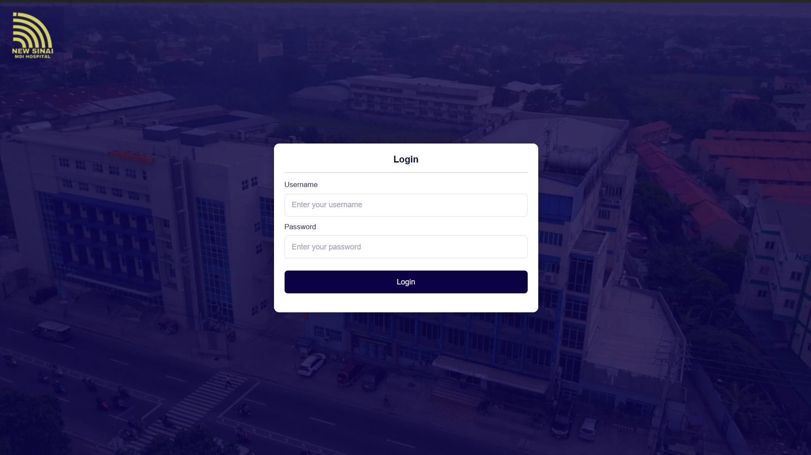
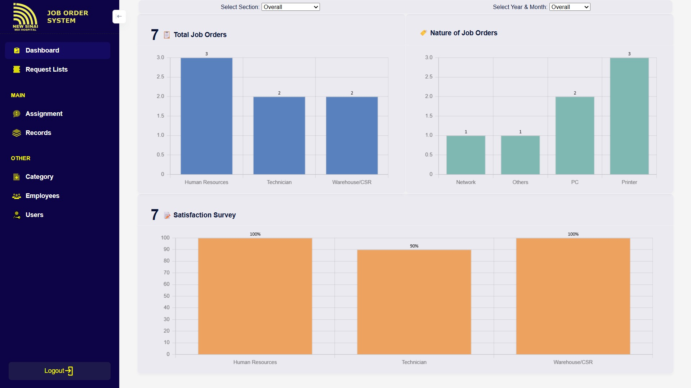
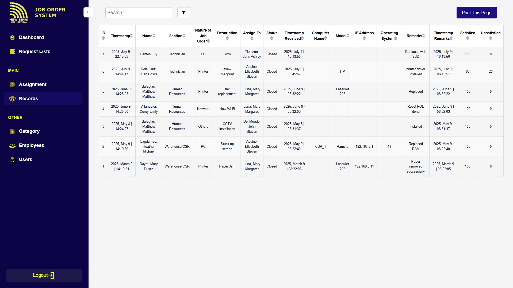
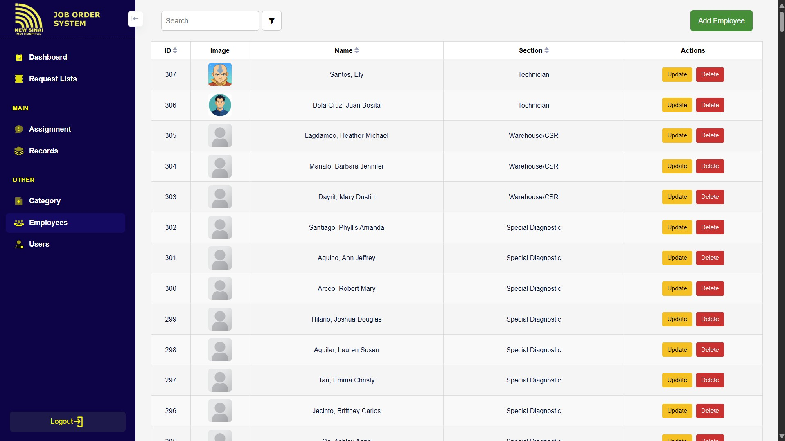
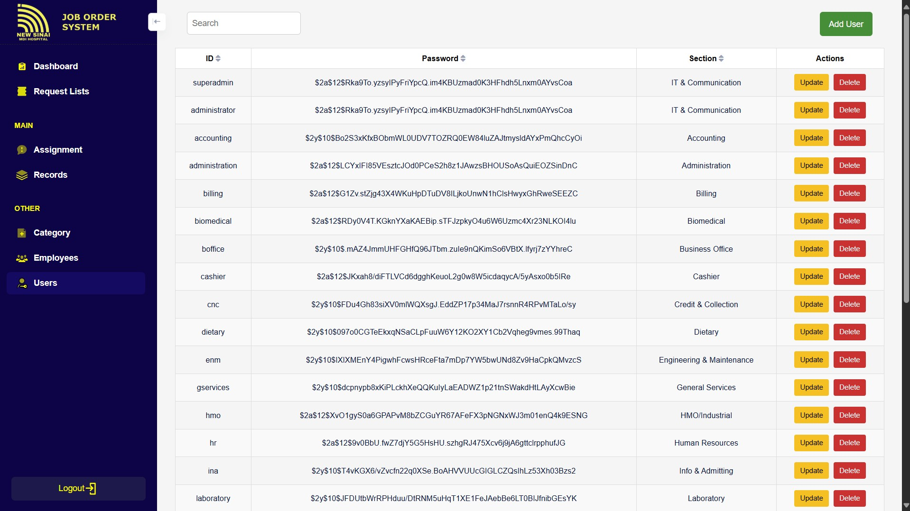
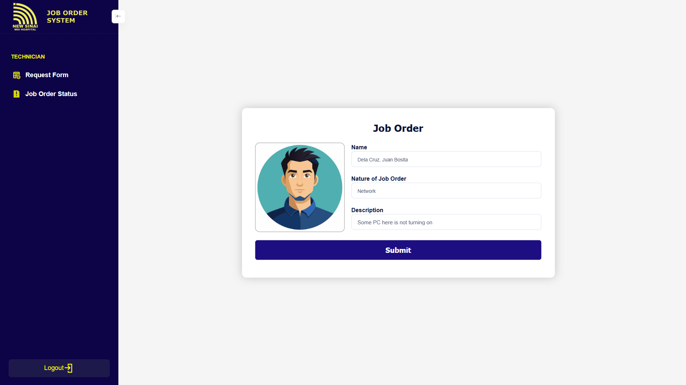
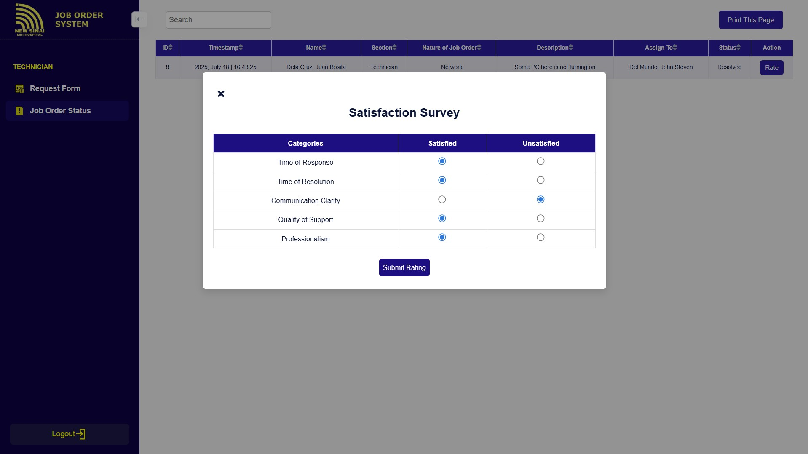

# Job Order System
A web-based ticketing system that allows end users to report IT-related issues, which are then tracked and addressed by IT administrators or personnel. The system also features a satisfaction rating to evaluate the quality of support after issue resolution.


## Features
- CRUD (Create, Read, Update, Delete)
- Searching, sorting, and checkbox data filtering in table
- Dashboard with filtering capabilities
- Section's account management
- Employee assignment
- Employee image assignment
- Satisfaction survey
- Issue addressing
- Reset password
- Input and data validation
- Ensured user access role and priviledges

## 📸 Samples







<p align="center"><a href="https://drive.google.com/file/d/1j-LG7ywVceQURo0zw6MFAzTKwd3hwlWo/view">See Video Demonstration</a></p>

## Tech Stacks
- Frontend: <strong>Metronic, HTML, CSS, JavaScript JQuery </strong>
- Backend: <strong>PHP</strong>
- Database: <strong>MySQL</strong>
- Tools: <strong>XAMPP, phpMyAdmin</strong>

## Setup
1. Clone this repository:
   ```bash
   git clone https://github.com/jeytix8/nsmdih.git
2. Move the project folder to htdocs/
3. Run XAMPP's Apache and MySql, then access http://localhost/phpmyadmin/
4. Create database and name it 'nsmdih_it'
5. Import nsmdih_it.sql file inside the database
6. Access the system with this url: http://localhost/logit/
    - *Username: superadmin*
    - *Default password: Generate BCrypt hash in [BCrypt Generator](https://bcrypt-generator.com/), copy and paste it directly at superadmin account password in the database.*

## Author
👨‍💻 **Jay Tee B. Talibsao**<br/>
📫 Email: jayteex8@gmail.com<br/>
🐙 GitHub: [@jeytix8](https://github.com/jeytix8)


> #### 📢 Disclaimer
> This project is shared publicly for **demonstration and portfolio purposes only**.  
> Please **do not use or distribute this code for commercial purposes** without prior permission.
>
> The company logo used in this project is for **visual demonstration only**.  
> It is the intellectual property of **[New Sinai MDI Hospital](https://newsinaimdi.com/)**.  
> No copyright ownership is claimed.
>
> `© jeytix8 2025`
